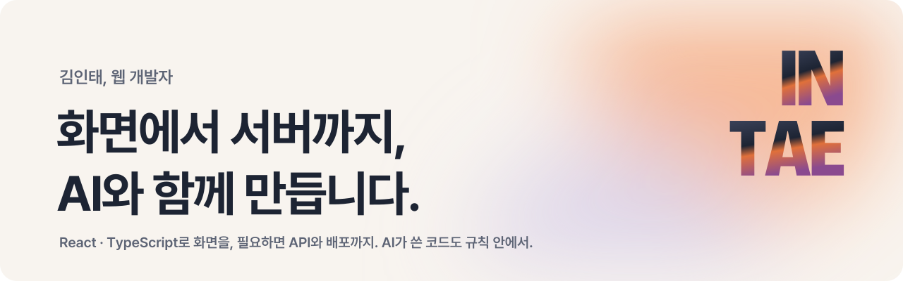

<a href="https://carlos-portfolio-orpin.vercel.app">
  <picture>
    <source media="(prefers-color-scheme: dark)" srcset="./assets/header-dark.svg">
    
  </picture>
</a>

  <a href="https://carlos-portfolio-orpin.vercel.app"><b>포트폴리오</b></a>
  &nbsp;·&nbsp;
  <a href="https://velog.io/@carloskim">velog</a>
  &nbsp;·&nbsp;
  <a href="mailto:dlsxody1@naver.com">dlsxody1@naver.com</a>

동물병원 임상 SaaS, 사내 전자결재, 기업 홈페이지를 만들어 왔습니다. 화면은 React와 TypeScript로 만들고, 문제가 서버나 배포에 있으면 그쪽도 직접 봅니다.

요즘은 Claude Code로 개발 과정 전체를 돌립니다. 그만큼 AI가 쓴 코드가 팀의 규칙을 지키게 하는 도구를 만드는 데 시간을 씁니다.

## 만든 것

| 프로젝트 | 내용 | |
| --- | --- | --- |
| **VitalVET** | 동물병원 임상 SaaS. 대시보드, 마취위험도 평가, 동의서, 입원 차트, 결제까지 프론트엔드 전담 | 비공개 |
| **MetaDx 홈페이지** | 기업 사이트 퍼블리싱, 어드민 연동, 다국어, 배포. 레포 커밋 171건 전부 | [metadxlab.com](https://metadxlab.com) |
| **VitalVET 캠페인** | 디자이너 없이 기획서 PPT 5장을 받아 Claude Code와 디자인 스킬로 설계하고 구현 | [보기](https://metadxlab.com/vitalvet-campaign) |
| **MetaDx Office** | 사내 전자결재와 경비 관리. 문서 6종, 15개월 1인 개발 | 비공개 |
| **[모퉁이](https://github.com/dlsxody1/motungi)** | 퇴근 후 동네 여가를 1~3개만 골라 주는 서비스. Next.js, Expo, Supabase | [motungi-web](https://motungi-web.vercel.app) |

## AI와 일하는 방식

- **파일을 고치는 순간 도는 규칙 훅.** Claude Code가 파일을 저장할 때마다 FSD 구조 위반 5종을 검사해 에이전트에게 바로 돌려줍니다. 기존 코드는 막지 않고 새 위반만 막습니다.
- **역할별 에이전트.** 스타일링과 UX 리뷰를 서브에이전트로 나누고, 반복 작업은 슬래시 커맨드 9종과 디자인 스킬 13종으로 묶었습니다.
- **밤마다 일하는 에이전트.** 모퉁이에서는 매일 밤 에이전트가 백로그 이슈를 구현하고, typecheck와 test를 통과할 때만 dev에 올립니다. main 승격은 사람이 검수한 뒤에만 합니다.
- **팀 사이 컨텍스트를 레포로.** 인프라·백엔드·ML 팀이 공유 레포의 요청, 공용 컨텍스트, 의사결정 로그를 같이 봅니다.

## 다루는 도구

  

TanStack Router·Query, Jotai, react-hook-form, React Native(Expo), Storybook, Playwright, Sentry, i18next, Claude Code, MCP
